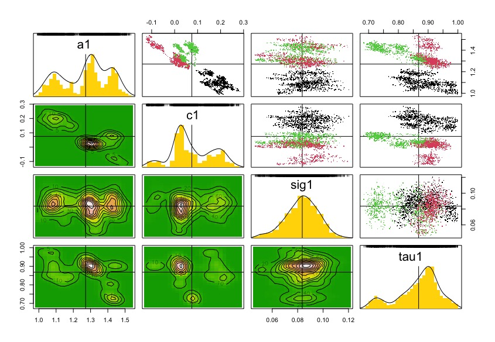
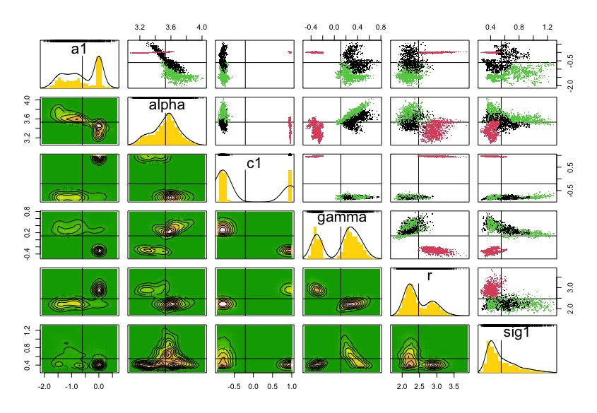
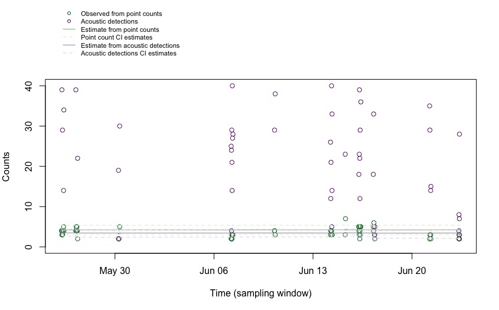
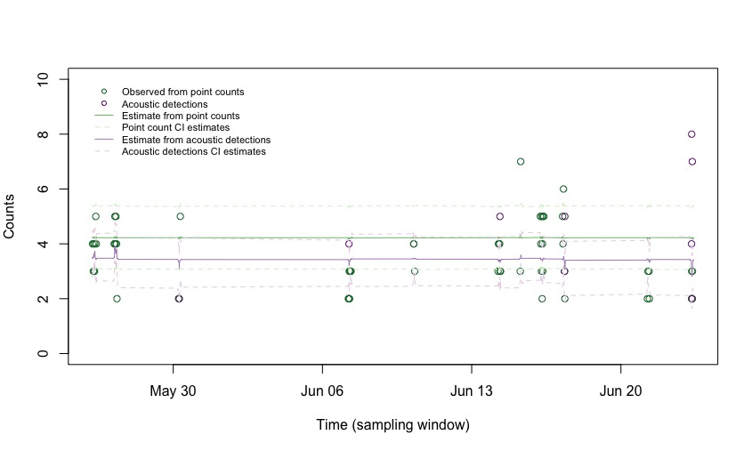

---
editor_options:
  chunk_output_type: console
---

# Hierarchical model approach

Here we want to evaluate the use of another approach for a hierarchical model of estimation of counts. First, we fit a dynamic autoregressive model to estimate stochastic counts that can be compared to conventional approaches (e.g., \textit{N}-mixture models). We can use this autoregressive model also to estimate the same latent counts from the acoustic detections data as observation process, including an extra parameter of scaling the acoustic activity (e.g., one individual singing more than a 1:1 relationship). 

We try this option first with a single species in a single site. However, this can be further extrapolated to use multispecies models, \textit{borrowing information} from abundant species in the community to estimate parameters of rare ones (sharing some characteristics), such as Beta N-Mixture \href{https://besjournals.onlinelibrary.wiley.com/doi/10.1111/2041-210X.12856}{Lopez et al. 2017} and Normal N-Mixture \href{https://esj-journals.onlinelibrary.wiley.com/doi/10.1007/s11284-016-1340-4}{Yamaura et al. 2016}. 

## Packages
```{r}
library(tidyverse)
library(MetBrewer)
library(dclone)
library(mcmcplots)
```

## Loading and exploring data

Let's load the file used in `01_data-comparability.Rmd` script. 

```{r loading data}
acous_count <- read_csv("results/pooled_pointCount_acoustic_data.csv")

acous_count |> # names()
  group_by(common_name, data_type, site_name) |>
  count() #|> View() # use filter in RStudio
```

Let's work on the species-site combination of more data: Ovenbird in Marsh-Billings-Rockefeller NHP.

```{r}
acous_count_filt <- acous_count |>
  filter(common_name %in% c(
    #"American Crow","American Robin","Black-and-white Warbler","Black-capped Chickadee","Black-throated Blue Warbler","Black-throated Green Warbler","Blackburnian Warbler","Blue Jay","Blue-headed Vireo","Brown Creeper","Eastern Wood-Pewee","Golden-crowned Kinglet","Hermit Thrush","Northern Parula",
    
                            "Ovenbird" 
                            
                            #,"Pine Warbler","Red-breasted Nuthatch","Red-eyed Vireo","Scarlet Tanager","Winter Wren","Yellow-bellied Sapsucker","Yellow-rumped Warbler"
                            ),
    site_name == "Marsh-Billings-Rockefeller NHP")
table(acous_count_filt$common_name, acous_count_filt$data_type)
```

The package `naniar` allow to see a good summar of NAs per column

```{r}
naniar::miss_var_summary(acous_count_filt)
```

How to reconcile time of detection of each record? 

While the `point_count` data include the `observation_time` variable, this information for the `acoustic_data` seems to be at the `begin_clock_time` variable. Let's adjust this with the function `coalesce` from `dplyr` in `tidyverse`. Then, we can consolidate the "initial temporal window" per visit in each site_id with the detection time.

```{r}
acoust_count_summary <- acous_count_filt |>
  # dummy column to unify time of detection either by count or 
  mutate(detection_time = coalesce(observation_time, begin_clock_time)) |>
  # initial temporal window
  group_by(site_id, date, visit_number) |>
  mutate(time_window = min(hms::as_hms(detection_time), na.rm = TRUE),
         time_window = hms::as_hms(time_window)) |>
  # First summarization to extract sum of counts per point count and number of detections
  group_by(site_name, site_id, date, visit_number, common_name, data_type, time_window, detection_time) |>
  summarise(abundance = sum(abundance, na.rm = TRUE),
         acous_detections = n()) |>
  # Second summarization to count number of detections and extract overall counts
  group_by(site_name, site_id, date, visit_number, common_name, time_window) |>
  summarise(counts = sum(abundance, na.rm = TRUE),
         acous_detections = sum(acous_detections)) |>
  as.data.frame()

acoust_count_summary$DateTime <- as.POSIXct(paste(acoust_count_summary$date, acoust_count_summary$time_window), format = "%Y-%m-%d %H:%M:%S")

acoust_count_summary$Time_window <- floor_date(acoust_count_summary$DateTime, "10 mins")

str(acoust_count_summary)
```

And we can generate the figures. This are similar to my previous attempt, but including some days or point counts discarded by Vijay due to species richness. 

### Figures of the data

Time series of the counts

```{r}
ggplot(acoust_count_summary,
       aes(x = Time_window, y = counts, color = site_name)) + 
  geom_segment(aes(y = 0, yend = counts), alpha = 0.3) + 
  geom_point(alpha = 0.6) + 
  facet_wrap(~common_name, ncol = 3) + 
  labs(x = "Time",
       y = "Number of individuals counted in a 10-minute point count",
       color = "Site")+
  scale_color_manual(values=met.brewer("Homer2", 4))+
  theme_minimal()+
  theme(legend.position = "bottom")
#ggsave(filename = "figs/counts-by-time-continuous.jpg", width = 10, height = 10, units = "in", dpi = 300)
```


Time series of acoustic detections

```{r}
ggplot(acoust_count_summary,
       aes(x = Time_window, y = acous_detections, color = site_name)) + 
  geom_segment(aes(y = 0, yend = acous_detections), alpha = 0.3) + 
  geom_point(alpha = 0.6) + 
  facet_wrap(~common_name, ncol = 3, scales = "free_y") + 
  labs(x = "Time",
       y = "Number of acoustic detections in a 10-minute recording",
       color = "Site")+
  scale_color_manual(values=met.brewer("Homer2", 4))+
  theme_minimal()+
  theme(legend.position = "bottom")
#ggsave(filename = "figs/acou_det-by-time-continuous.jpg", width = 10, height = 10, units = "in", dpi = 300)
```


This summary dataset also allow to see the potential effect of phenology. We can see the two years independently

```{r}
acoust_count_summary |>
  mutate(year = year(date)) |>
  filter(year == 2022) |>
  ggplot(aes(x = Time_window, y = counts, color = site_name))+
  geom_segment(aes(y = 0, yend = counts), alpha = 0.3) + 
  geom_point(alpha = 0.6) + 
  facet_wrap(~common_name, ncol = 3) + 
  labs(x = "Date-Time of survey (2022)",
       y = "Number of individuals counted in a 10-minute point count",
       color = "Site")+
  scale_color_manual(values=met.brewer("Homer2", 4))+
  theme_minimal()+
  theme(legend.position = "bottom")
#ggsave(filename = "figs/counts-by-date_2022.jpg", width = 10, height = 10, units = "in", dpi = 300)
```


```{r}
acoust_count_summary |>
  mutate(year = year(date)) |>
  filter(year == 2022) |>
  ggplot(aes(x = Time_window, y = acous_detections, color = site_name))+
  geom_segment(aes(y = 0, yend = acous_detections), alpha = 0.3) + 
  geom_point(alpha = 0.6) + 
  facet_wrap(~common_name, ncol = 3, scales = "free_y") + 
  labs(x = "Date-Time of survey (2022)",
       y = "Number of acoustic detections in a 10-minute recording",
       color = "Site")+
  scale_color_manual(values=met.brewer("Homer2", 4))+
  theme_minimal()+
  theme(legend.position = "bottom")
#ggsave(filename = "figs/acou_det-by-date_2022.jpg", width = 10, height = 10, units = "in", dpi = 300)
```


And for 2023:
```{r}
acoust_count_summary |>
  mutate(year = year(date)) |>
  filter(year == 2023) |>
  ggplot(aes(x = DateTime, y = counts, color = site_name))+
  geom_segment(aes(y = 0, yend = counts), alpha = 0.3) + 
  geom_point(alpha = 0.6) + 
  facet_wrap(~common_name, ncol = 3) + 
  labs(x = "Date of survey (2023)",
       y = "Number of individuals counted in a 10-minute point count",
       color = "Site")+
  scale_color_manual(values=met.brewer("Homer2", 4))+
  theme_minimal()+
  theme(legend.position = "bottom")
#ggsave(filename = "figs/counts-by-date_2023.jpg", width = 10, height = 10, units = "in", dpi = 300)
```


```{r}
acoust_count_summary |>
  mutate(year = year(date)) |>
  filter(year == 2023) |>
  ggplot(aes(x = DateTime, y = acous_detections, color = site_name))+
  geom_segment(aes(y = 0, yend = acous_detections), alpha = 0.3) + 
  geom_point(alpha = 0.6) + 
  facet_wrap(~common_name, ncol = 3, scales = "free_y") + 
  labs(x = "Date of survey (2023)",
       y = "Number of acoustic detections in a 10-minute recording",
       color = "Site")+
  scale_color_manual(values=met.brewer("Homer2", 4))+
  theme_minimal()+
  theme(legend.position = "bottom")
#ggsave(filename = "figs/acou_det-by-date_2023.jpg", width = 10, height = 10, units = "in", dpi = 300)
```


These figures serve to see that the date of visit have a more clear effect in acoustic detections than on counts. We can incorporate these covariates in a hierarchical model.

These figures also allow to estimate the variance-to-mean ratio (VMR) of our two data sources (counts and acoustic detections) to select a family distribution accordingly. Recall a simple, clear table of VMR values:
```{r}
VMR_table <- data.frame(
  Distribution = c("Constant random variable", "Binomial","Poisson", "Negative binomial"),
  VMR = c("VMR = 0", "0<VMR<1", "VMR = 1", "VMR>1")
)
knitr::kable(VMR_table)
```

So, estimating these VMR per species:
```{r}
acoust_count_summary |>
  group_by(common_name) |>
  summarise(meanCounts = mean(counts),
            varCounts = var(counts), 
            VMR_counts = varCounts/meanCounts,
            meanAcouDet = mean(acous_detections),
            varAcouDet = var(acous_detections), 
            VMR_AcouDet = varAcouDet/meanAcouDet) |> #summary()
  as.data.frame() # to see all the table
```

We can see that VMR_counts is between 0 and 1, while VMR_AcousticDetection > 1. These ranges suggest using a Binomial and a Negative binomial distributions, respectively, in the observation process.

## Hierarchical model for counts with two observation processes

### State process for morning expected counts

Assuming that every morning of sampling we find a latent number of individuals in each site (including several point counts) that fluctuates around a mean stationary number, we can see some similarities with a Stochastic Gompertz State Space population dynamics model, which in continuous time follows a Gaussian (Ornstein-Uhlenbeck, OU) diffusion dynamic.

Let's model the latent process of log-counts $X_{i,t} = \ln(C_{i,t})$ for species $i$ in time $t$ (sampling point count) in a site $m$. We can simplify this (for now) by only working in a site ($m = 1$; Marsh-Billings-Rockefeller NHP) and a single species example ($i = 1$; Ovenbird - OVEN). On the logarithmic scale, the process becomes linear and follows an autoregressive model of order 1 (note we are not including the index $m$ nor $i$ for now):

$$
X_{t+1} = a + c * X_{t} + \epsilon_{t}; ~ \epsilon \sim \text{Normal}(0,\sigma^2)
$$
where $a$ control the drift (equivalent to the initial condition at $t=1$, and then the maximum growth rate in a population model), $c$ controls the mean-reverting dynamic (such as the strength of density dependence, $c = 1 + b$ in a population model), and $\epsilon_{t}$ captures stochasticity in the process, distributed as a normal random variable with some noise of the process $\sigma^2$. In the long-run, we can estimate the mean of the log-counts as a function of the control drift and mean-reverting dynamic:

$$
\text{E}[X_{\infty}] = \frac{a}{1-c}
$$

Also the variance of the log-counts is given by the ratio of variance in stochasticity and the square of the mean-reverting dynamic:

$$
\text{Var}[X_{\infty}] = \frac{\sigma^2}{1-c^2}
$$

However, how to deal with Jansen's inequality?! 

$$
e^{(\text{E}[X_\infty])} \leq \text{E}[e^{(X_\infty)}]
$$

We can estimate the long-run mean count value on the original scale by adding half of the variance, which is our expected counts per species $i$:

$$
\text{E}[C_{\infty}] = e^{(\text{E}[X_{\infty}] + (0.5 \times \text{Var}[X_{\infty}]))}
$$

### Observation process for morning point counts

The VMR_counts revealed underdispersion, so we can us a Binomial distribution for this observation process:

$$
Y_{t}^{Counts} | C_{t} \sim \text{Binomial}(\lambda_{t},~\tau), ~ \lambda_{t} = e^{X_{t}} = C_{t}
$$
where $Y_{t}^{counts}$ is the observed counts from point counts sampling, linked to the latent (unobserved) counts $C_{t}$, assuming that counts are noisy realizations of the true abundance under a binomial distribution with expected "success" counts of $\lambda_{t}$ and detection probability $\tau$.

### Observation process for morning acoustic detections

The VMR_AcousticDetection revealed overdispersion, so we can use a Negative Binomial distribution for this observation process:

$$
Y_{t}^{AcoustDet}|C_t \sim \text{Negative Binomial}(p_{t}, r)
$$
where $Y_{t}^{AcoustDet}$ is the observed acoustic detections from sampling point (that overlap with point counts), $p_{t} = \frac{r}{r+\lambda_t}$ represents the success parameter, being a ratio of the (over)dispersion parameter $r$ and the sum of the overdispersion parameter and the mean expected counts $\lambda_t = e^{X_t} = C_t$. Given that the number of acoustic detection counts does not have a perfect 1:1 relationship with expected counts, we can formulate a log-linear relationship for $\lambda_t$:

$$
\log(\lambda_{t}) = \alpha + \gamma X_{t}
$$
where $\alpha$ is a species-level intercept and $\gamma$ is the scaling parameter with the latent log-abundance $X_{t}$.

### Coding Observation point counts 

Preparing data for data cloning
```{r}

acoust_count_df <- acoust_count_summary |>
  mutate(Time_w_alone = format(as.POSIXct(Time_window, format = "%Y-%m-%d %H:%M:%S"), "%H:%M"), 
         counts = counts+1,
         acous_detections = acous_detections+1,
         year = year(date), 
         ) |>
  filter(year == 2022) |>
  arrange(Time_window)

# generate sequence of potential point counts
seq_df <- acoust_count_df |>
  distinct(date) |>   # keep only unique sampled dates
  mutate(seq = map(date, ~ seq(
    from = as.POSIXct(paste(.x, "05:00:00")),
    to   = as.POSIXct(paste(.x, "10:00:00")),
    by   = "10 min"
  ))) |>
  unnest(seq) |>
  mutate(Time_window = seq,
         Time_w_alone = format(seq, "%H:%M"))

final_df <- seq_df |>
  select(c(date, Time_w_alone)) |>
  left_join(acoust_count_df, by = c("date", "Time_w_alone")) 

final_df$DateTime <- as.POSIXct(paste(final_df$date, final_df$Time_w_alone), format = "%Y-%m-%d %H:%M")

final_df$time_id <- as.integer(factor(final_df$DateTime))

```

```{r Stochastic GSS model for data cloning fitting of point counts}
StochGSS.dc <- function(){
  
  # Priors on model parameters. Priors are DC1 in Lele et al (2007)
  a1 ~ dnorm(0,1);        # constant, equivalent to the population growth rate. 
  c1 ~ dunif(-1,1);       # constant, the density dependence parameter. 
  sig1 ~ dlnorm(-0.5,10); #variance parameter of stochastic  environment (process noise) in the system
  stovar1 <- 1/pow(sig1,2)
  tau1 ~ dunif(0,1); # detection probability in Binomial distribution
  
  for(k in 1:K){
    # Simulate trajectory that depends on the previous
    mean_X1[1,k] <- a1/(1-c1) # Expected value of the first realization of the process
    # this is drawn from the stationary distribution of the process
    # Equation 14 (main text) and  A.4 in Appendix of Dennis et al 2006
    Varno1[k] <- pow(sig1,2)/(1-pow(c1,2)) #. Equation A.5 in Appendix of Dennis et al 2006
    
    # Updating the state: Stochastic process for all time steps
    X1[1,k]~dnorm(mean_X1[1,k], 1/Varno1[k]); #first estimation of population
    
    #iteration of the GSS model in the data
    for (t in 2:qp1) {
      mean_X1[t,k] <- a1 + c1 * X1[(t - 1),k]
      X1[t,k] ~ dnorm(mean_X1[t,k], stovar1) # Et is included here since a+cX(t-1) + Et ~ Normal(a+cX(t-1),sigma^2)
    }
    
    # Updating the observations, from the counts under Binomial observation error
    for (t in 1:qp1) {
      N1[t,k] ~ dpois(exp(X1[t,k]))   # trick to convert continuous exp(X1) to integer counts as trials
      Y1[t,k] ~ dbin(tau1, N1[t,k])   # 
    }
  }
}

```

For this model, we will need some initial values of the parameters, and given that there could be many `NA` a wrap to provide those initial guess values.

```{r two functions to guess initial parameters in point counts}
guess.calc <- function(Yobs,Tvec){
  
  T.t <-Tvec-Tvec[1]; #  For calculations, time starts at zero.
  q <- length(Yobs)-1;      #  Number of time series transitions, q.
  qp1 <- q+1;              #  q+1 gets used a lot, too.
  S.t <- T.t[2:qp1]-T.t[1:q];  #  Time intervals.
  Ybar <- mean(Yobs);
  Yvar <- sum((Yobs-Ybar)*(Yobs-Ybar))/q;
  mu1 <- Ybar;
  
  # Kludge an initial value for theta based on mean of Y(t+s) given Y(t).
  th1<- -mean(log(abs((Yobs[2:qp1]-mu1)/(Yobs[1:q]-mu1)))/S.t);            
  bsq1<- 2*th1*Yvar/(1+2*th1);         # Moment estimate using stationary
  tsq1<- bsq1;                         #   variance, with betasq=tausq.
  
  #three 0's 
  three0s <- sum(c(th1,bsq1,tsq1))
  if(three0s==0|is.na(three0s)){th1 <- 0.5;bsq1 <- 0.09; tsq1 <- 0.23;}
  
  
  out1 <- c(th1,bsq1,tsq1);
  if(sum(out1<1e-7)>=1){out1 <- c(0.5,0.09,0.23)}
  out <- c(mu1,out1);
  return(abs(out))
  
}

guess.calc2.0<- function(TimeAndNs){
  
  newmat <- TimeAndNs 
  isnas <- sum(is.na(TimeAndNs))
  
  if(isnas >= 1){
    
    isnaind <- which(is.na(TimeAndNs[,2]), arr.ind=TRUE)
    newmat <- TimeAndNs[-isnaind,]
    newmat[,1] <- newmat[,1] - newmat[1,1]
    
  }
  
  init.guess <- guess.calc(Yobs = log(newmat[,2]), Tvec=newmat[,1])
  
  mu1  <- init.guess[1]
  th1  <- init.guess[2]
  bsq1 <- init.guess[3]
  sigsq1<- ((1-exp(-2*th1))*bsq1)/(2*th1)
  
  out <- c(mu=mu1, theta=th1, sigmasq = sigsq1)
  return(out)
}
```

And we have to bundle the data for Data cloning. Let's fit the first species in the taxa with higher data (Ovenbird in Marsh-Billings-Rockefeller NHP) as a test.

```{r Fit DC model, eval=FALSE}
ts.4guess  <-  final_df$counts
tvec4guess  <- 1:length(ts.4guess)
onets4guess <- cbind(tvec4guess, ts.4guess)
naive.guess <- guess.calc2.0(TimeAndNs = onets4guess)

datalistGSS.dc <- list(K = 1,
                       qp1 = length(ts.4guess),
                       Y1 = dcdim(array(ts.4guess,
                                        dim = c(length(ts.4guess),1)))) 

dcrun.GSS <- dc.fit(data = datalistGSS.dc,
                    params = c("a1", "c1", "sig1", "tau1"), 
                    model = StochGSS.dc, 
                    n.clones = c(1,5,10,20),
                    multiply = "K",
                    unchanged = "qp1",
                    n.chains = 3,
                    n.adapt = 5000,
                    n.update = 100,
                    thin = 20,
                    n.iter = 20000)

saveRDS(dcrun.GSS, "data/dcfitGSS_2022_OVEN_MBR.rds")
```


```{r results of the data cloning fitted model point counts}
dcrun.GSS <- readRDS("data/dcfitGSS_2022_OVEN_MBR.rds")

summary(dcrun.GSS);
dcdiag(dcrun.GSS) 
plot(dcdiag(dcrun.GSS))
pairs(dcrun.GSS)
coef(dcrun.GSS)
```


And with these coefficients of the model, we can estimate latent count trajectories with the Kalman filter structure. This Kalman filter structure allows simultaneous estimation of latent states for observed time steps and prediction for missing ones, leveraging the temporal correlation in the process model.

```{r Kalman trajectories model point counts}
Kalman.pred.fn <- function() {
# Priors on model parameters: they are on the real line.
  parms ~ dmnorm(MuPost,PrecPost)
  a1 <- parms[1]   
  c1 <- parms[2] 
  sig1 <- parms[3]
  stovar1 <- 1/pow(sig1,2)
  tau1 ~ dunif(0,1)
  
  # Likelihood
  mean_X1[1] <- a1/(1-c1) # Expected value of the first realization of the process
    # this is drawn from the stationary distribution of the process
    # Equation 14 (main text) and  A.4 in Appendix of Dennis et al 2006
    Varno1 <- pow(sig1,2)/(1-pow(c1,2)) #. Equation A.5 in Appendix of Dennis et al 2006
    
    # Updating the state: Stochastic process for all time steps
    X1[1]~dnorm(mean_X1[1], 1/Varno1); #first estimation of population
    C[1] <- exp(X1[1])
    #iteration of the GSS model in the data
    for (t in 2:qp1) {
      mean_X1[t] <- a1 + c1 * X1[(t - 1)]
      X1[t] ~ dnorm(mean_X1[t], stovar1) # Et is included here since a+cX(t-1) + Et ~ Normal(a+cX(t-1),sigma^2)
      N[t] ~ dpois(exp(X1[t]))   # trick to convert continuous exp(X1) to integer counts as trials in binomial
      Y1[(t-1)] ~ dbin(tau1, N[t])   # 
      C[t] <- exp(X1[t]) # expected count
    }
}
```


```{r data for Kalman trajectories point counts}
data4kalman <- list(qp1 = as.numeric(length(final_df$counts)),
                    Y1 = array(final_df$counts,
                               dim = c(as.numeric(length(final_df$counts)))),
                    MuPost = coef(dcrun.GSS),
                    PrecPost = solve(vcov(dcrun.GSS))) 
```

And run the Bayesian inference using the MLE from Data cloning

```{r Fit Bayes Kalman trajectories point counts}
BH_DC_Pred = jags.fit(data=data4kalman, 
                      params=c("C"), 
                      model=Kalman.pred.fn)
```

And we can generate a dataframe of the time series with the estimates, inter quartile range, and observed data through time

```{r Kalman trajectories point counts}
summary(BH_DC_Pred)
# extract predictions and CI around them
pred <- as.data.frame(t(mcmcapply(BH_DC_Pred, quantile, c(0.025, 0.5, 0.975))))

ExpectedCounts <- as.data.frame(cbind(final_df,pred))
# modify names 
names(ExpectedCounts) <- c("date","Time_w_alone","site_name","site_id",
                          "visit_number","common_name","time_window",
                          "Observed",
                          "acous_detections","DateTime","Time_window", "year",
                          "time_id","Lower", "Estimated", "Upper")


ExpectedCounts |>
  pivot_longer(cols = c(Lower, Estimated, Upper, Observed),
               names_to = "Abundance",
               values_to = "Count") |> 
  ggplot(aes(x = DateTime, 
             y = Count, 
             color = factor(Abundance,
                            levels = c("Observed",
                                       "Upper",
                                       "Estimated",
                                       "Lower")))) +
    geom_line(aes(linetype = factor(Abundance,
                            levels = c("Observed",
                                       "Upper",
                                       "Estimated",
                                       "Lower")))) +
    geom_point(aes(shape = factor(Abundance,
                            levels = c("Observed",
                                       "Upper",
                                       "Estimated",
                                       "Lower")))) +
    labs(title = "OVEN - Marsh-Billings-Rockefeller NHP - 2022 sampling",
         x = "Time (sampling window)",
         y = "Counts",
         color = "Counts",
         linetype = "Counts",
         shape = "Counts") +
    scale_linetype_manual(values = c(NA,"dashed","solid","dashed"))+
    scale_shape_manual(values = c(21, NA,NA,NA)) +
    scale_color_manual(values = c("blue","darkgray","black","darkgray")) +
    theme_classic() +
    theme(legend.position = "bottom")
```


### Coding Acoustic detections counts

```{r Stochastic GSS model for data cloning fitting acoustic detections}
StochGSS.acou.dc <- function(){
  
  # Priors on model parameters. Priors are DC1 in Lele et al (2007)
  a1 ~ dnorm(0,1);        # constant, equivalent to the population growth rate. 
  c1 ~ dunif(-1,1);       # constant, the density dependence parameter. 
  sig1 ~ dlnorm(-0.5,10); #variance parameter of stochastic  environment (process noise) in the system
  stovar1 <- 1/pow(sig1,2)
  
   # Priors for observation model
  alpha ~ dnorm(0, 0.001)  # intercept for scaling
  gamma ~ dnorm(0, 0.001)  # slope linking latent state X_t to mean
  r ~ dunif(0,50)   # dispersion parameter for NegBin
  
  for(k in 1:K){
    # Simulate trajectory that depends on the previous
    mean_X1[1,k] <- a1/(1-c1) # Expected value of the first realization of the process
    # this is drawn from the stationary distribution of the process
    # Equation 14 (main text) and  A.4 in Appendix of Dennis et al 2006
    Varno1[k] <- pow(sig1,2)/(1-pow(c1,2)) #. Equation A.5 in Appendix of Dennis et al 2006
    
    # Updating the state: Stochastic process for all time steps
    X1[1,k]~dnorm(mean_X1[1,k], 1/Varno1[k]); #first estimation of population
    
    #iteration of the GSS model in the data
    for (t in 2:qp1) {
      mean_X1[t,k] <- a1 + c1 * X1[(t - 1),k]
      X1[t,k] ~ dnorm(mean_X1[t,k], stovar1) # Et is included here since a+cX(t-1) + Et ~ Normal(a+cX(t-1),sigma^2)
    }
    
    # Updating the observations, from the acoustic detections under Negative Binomial observation error
    for (t in 1:qp1) {
      Y1[t,k] ~ dnegbin(p[t,k], r)
      p[t,k] <- r/(r+lambda[t,k])
      log(lambda[t,k]) <- alpha + gamma * X1[t,k]
      }
  }
}

```

For this model, we will need some initial values of the parameters, and given that there could be many `NA` a wrap to provide those initial guess values.

```{r two functions to guess initial parameters acoustic detections but same point counts}
guess.calc <- function(Yobs,Tvec){
  
  T.t <-Tvec-Tvec[1]; #  For calculations, time starts at zero.
  q <- length(Yobs)-1;      #  Number of time series transitions, q.
  qp1 <- q+1;              #  q+1 gets used a lot, too.
  S.t <- T.t[2:qp1]-T.t[1:q];  #  Time intervals.
  Ybar <- mean(Yobs);
  Yvar <- sum((Yobs-Ybar)*(Yobs-Ybar))/q;
  mu1 <- Ybar;
  
  # Kludge an initial value for theta based on mean of Y(t+s) given Y(t).
  th1<- -mean(log(abs((Yobs[2:qp1]-mu1)/(Yobs[1:q]-mu1)))/S.t);            
  bsq1<- 2*th1*Yvar/(1+2*th1);         # Moment estimate using stationary
  tsq1<- bsq1;                         #   variance, with betasq=tausq.
  
  #three 0's 
  three0s <- sum(c(th1,bsq1,tsq1))
  if(three0s==0|is.na(three0s)){th1 <- 0.5;bsq1 <- 0.09; tsq1 <- 0.23;}
  
  
  out1 <- c(th1,bsq1,tsq1);
  if(sum(out1<1e-7)>=1){out1 <- c(0.5,0.09,0.23)}
  out <- c(mu1,out1);
  return(abs(out))
  
}

guess.calc2.0<- function(TimeAndNs){
  
  newmat <- TimeAndNs 
  isnas <- sum(is.na(TimeAndNs))
  
  if(isnas >= 1){
    
    isnaind <- which(is.na(TimeAndNs[,2]), arr.ind=TRUE)
    newmat <- TimeAndNs[-isnaind,]
    newmat[,1] <- newmat[,1] - newmat[1,1]
    
  }
  
  init.guess <- guess.calc(Yobs = log(newmat[,2]), Tvec=newmat[,1])
  
  mu1  <- init.guess[1]
  th1  <- init.guess[2]
  bsq1 <- init.guess[3]
  sigsq1<- ((1-exp(-2*th1))*bsq1)/(2*th1)
  
  out <- c(mu=mu1, theta=th1, sigmasq = sigsq1)
  return(out)
}
```

And we have to bundle the data for Data cloning. Let's fit the first species in the taxa with higher data (Ovenbird in Marsh-Billings-Rockefeller NHP) as a test.

```{r Fit DC model acoustic detections, eval=FALSE}
ts.4guess  <-  as.numeric(final_df$acous_detections)
tvec4guess  <- 1:length(ts.4guess)
onets4guess <- cbind(tvec4guess, ts.4guess)
naive.guess <- guess.calc2.0(TimeAndNs = onets4guess)

datalistGSS.acou.dc <- list(K = 1,
                       qp1 = length(ts.4guess),
                       Y1 = dcdim(array(ts.4guess,
                                        dim = c(length(ts.4guess),1)))) 

dcrun.GSS.acou <- dc.fit(data = datalistGSS.acou.dc,
                    params = c("a1", "c1", "sig1", "gamma", "alpha", "r"), 
                    model = StochGSS.acou.dc, 
                    n.clones = c(1,5,10,20),
                    multiply = "K",
                    unchanged = "qp1",
                    n.chains = 3,
                    n.adapt = 5000,
                    n.update = 100,
                    thin = 20,
                    n.iter = 20000)

saveRDS(dcrun.GSS.acou, "data/dcfitGSS_AcDet_2022_OVEN_MBR.rds")
```


```{r results of the data cloning fitted model acoustic detections}
dcrun.GSS.acou <- readRDS("data/dcfitGSS_AcDet_2022_OVEN_MBR.rds")

summary(dcrun.GSS.acou);
dcdiag(dcrun.GSS.acou) 
plot(dcdiag(dcrun.GSS.acou))
pairs(dcrun.GSS.acou)
coef(dcrun.GSS.acou)
```


Although diagnostics for lambda.max decreases with more clones, the chains are not converging. It seems that this needs more iterations and change initial values. 

Anyway, with these coefficients of the model, we can estimate latent count trajectories with the Kalman filter structure. This Kalman filter structure allows simultaneous estimation of latent states for observed time steps and prediction for missing ones, leveraging the temporal correlation in the process model.

```{r Kalman trajectories model acoustic detections}
Kalman.pred.acou.fn <- function() {
# Priors on model parameters: they are on the real line.
  parms ~ dmnorm(MuPost,PrecPost)
  a1 <- parms[1]   
  alpha <- parms[2]   # intercept for scaling
  c1 <- parms[3] 
  gamma <- parms[4]  # slope linking latent state X_t to mean
  r <- parms[5]      # overdispersion parameter for NegBinom
  sig1 <- parms[6]
  stovar1 <- 1/pow(sig1,2)

  # Likelihood
  mean_X1[1] <- a1/(1-c1) # Expected value of the first realization of the process
    # this is drawn from the stationary distribution of the process
    # Equation 14 (main text) and  A.4 in Appendix of Dennis et al 2006
    Varno1 <- pow(sig1,2)/(1-pow(c1,2)) #. Equation A.5 in Appendix of Dennis et al 2006
    
    # Updating the state: Stochastic process for all time steps
    X1[1]~dnorm(mean_X1[1], 1/Varno1); #first estimation of population
    log(lambda[1]) <- alpha + gamma * X1[1]
    C[1] <- log(lambda[1])
    #iteration of the GSS model in the data
    for (t in 2:qp1) {
      mean_X1[t] <- a1 + c1 * X1[(t - 1)]
      X1[t] ~ dnorm(mean_X1[t], stovar1) # Et is included here since a+cX(t-1) + Et ~ Normal(a+cX(t-1),sigma^2)
      
      Y1[(t-1)] ~ dnegbin(p[t], r)
      p[t] <- r/(r+lambda[t])
      log(lambda[t]) <- alpha + gamma * X1[t]
      C[t] <- log(lambda[t]) # expected count
    }
}
```


```{r data for Kalman trajectories acoustic detections}
data4kalmanAco <- list(qp1 = as.numeric(length(final_df$acous_detections)),
                    Y1 = array(final_df$acous_detections,
                               dim = c(as.numeric(length(final_df$acous_detections)))),
                    MuPost = coef(dcrun.GSS.acou),
                    PrecPost = solve(vcov(dcrun.GSS.acou))) 
```

And run the Bayesian inference using the MLE from Data cloning

```{r Fit Bayes Kalman trajectories acoustic detections}
BH_DC_Pred_Acou = jags.fit(data=data4kalmanAco, 
                      params=c("C"), 
                      model=Kalman.pred.acou.fn)
```

And we can generate a dataframe of the time series with the estimates, inter quartile range, and observed data through time

```{r Kalman trajectories acoustic detections}
summary(BH_DC_Pred_Acou)
# extract predictions and CI around them
predAcou <- as.data.frame(t(mcmcapply(BH_DC_Pred_Acou, quantile, c(0.025, 0.5, 0.975))))


ExpectedCountsAcou <- as.data.frame(cbind(ExpectedCounts,predAcou))
# modify names 
names(ExpectedCountsAcou) <- c("date","Time_w_alone","site_name","site_id",
                          "visit_number","common_name","time_window",
                          "Observed",
                          "AcousticDetections",
                          "DateTime","Time_window", "year",
                          "time_id",
                          "CountLower", "CountEstimated", "CountUpper",
                          "AcouDetLower", "AcouDetEstimated", "AcouDetUpper")

par(mar = c(5, 4, 7, 2))  # low, left, up, right

plot(x = ExpectedCountsAcou$DateTime,
     y = ExpectedCountsAcou$Observed, 
     col = "#1b7837", 
     ylim = c(0,40), 
     ylab = "Counts",
     xlab = "Time (sampling window)")
points(x = ExpectedCountsAcou$DateTime,
     y = ExpectedCountsAcou$AcousticDetections, 
     col = "#762a83")
lines(x = ExpectedCountsAcou$DateTime,
     y = ExpectedCountsAcou$CountEstimated, 
     col = "#7fbf7b")
lines(x = ExpectedCountsAcou$DateTime,
     y = ExpectedCountsAcou$CountLower, 
     col = "#d9f0d3", lty = 2)
lines(x = ExpectedCountsAcou$DateTime,
     y = ExpectedCountsAcou$CountUpper, 
     col = "#d9f0d3", lty = 2)
lines(x = ExpectedCountsAcou$DateTime,
     y = ExpectedCountsAcou$AcouDetEstimated, 
     col = "#af8dc3")
lines(x = ExpectedCountsAcou$DateTime,
     y = ExpectedCountsAcou$AcouDetLower, 
     col = "#e7d4e8", lty = 2)
lines(x = ExpectedCountsAcou$DateTime,
     y = ExpectedCountsAcou$AcouDetUpper, 
     col = "#e7d4e8", lty = 2)

legend(x = min(ExpectedCountsAcou$DateTime),
       y = 60,
       cex = 0.7, 
       pt.cex = 0.7,
       xpd = TRUE,
       horiz = FALSE,
       legend = c("Observed from point counts", 
                  "Acoustic detections", 
                  "Estimate from point counts", 
                  "Point count CI estimates", 
                  "Estimate from acoustic detections", 
                  "Acoustic detections CI estimates"),
       col = c("#1b7837", 
               "#762a83", 
               "#7fbf7b", 
               "#d9f0d3", 
               "#af8dc3", 
               "#e7d4e8"),
       lty = c(NA, NA, 1, 2, 1, 2),   # NA for points, 1 for solid lines, 2 for dashed
       pch = c(1, 1, NA, NA, NA, NA), # symbols for points
       bty = "n")                     # no box around legend

```



Cutting the edges to see the details of the estimates:

```{r figure zoom combining two estimates as lines}
par(mar = c(6, 4, 4, 2))  

plot(x = ExpectedCountsAcou$DateTime,
     y = ExpectedCountsAcou$Observed, 
     col = "#1b7837", 
     ylim = c(0,10), 
     ylab = "Counts",
     xlab = "Time (sampling window)")
points(x = ExpectedCountsAcou$DateTime,
     y = ExpectedCountsAcou$AcousticDetections, 
     col = "#762a83")
lines(x = ExpectedCountsAcou$DateTime,
     y = ExpectedCountsAcou$CountEstimated, 
     col = "#7fbf7b")
lines(x = ExpectedCountsAcou$DateTime,
     y = ExpectedCountsAcou$CountLower, 
     col = "#d9f0d3", lty = 2)
lines(x = ExpectedCountsAcou$DateTime,
     y = ExpectedCountsAcou$CountUpper, 
     col = "#d9f0d3", lty = 2)
lines(x = ExpectedCountsAcou$DateTime,
     y = ExpectedCountsAcou$AcouDetEstimated, 
     col = "#af8dc3")
lines(x = ExpectedCountsAcou$DateTime,
     y = ExpectedCountsAcou$AcouDetLower, 
     col = "#e7d4e8", lty = 2)
lines(x = ExpectedCountsAcou$DateTime,
     y = ExpectedCountsAcou$AcouDetUpper, 
     col = "#e7d4e8", lty = 2)

legend(x = min(ExpectedCountsAcou$DateTime),
       y = 10,
       cex = 0.7, 
       pt.cex = 0.7,
       xpd = TRUE,
       horiz = FALSE,
       legend = c("Observed from point counts", 
                  "Acoustic detections", 
                  "Estimate from point counts", 
                  "Point count CI estimates", 
                  "Estimate from acoustic detections", 
                  "Acoustic detections CI estimates"),
       col = c("#1b7837", 
               "#762a83", 
               "#7fbf7b", 
               "#d9f0d3", 
               "#af8dc3", 
               "#e7d4e8"),
       lty = c(NA, NA, 1, 2, 1, 2),   # NA for points, 1 for solid lines, 2 for dashed
       pch = c(1, 1, NA, NA, NA, NA), # symbols for points
       bty = "n")                     # no box around legend

```


