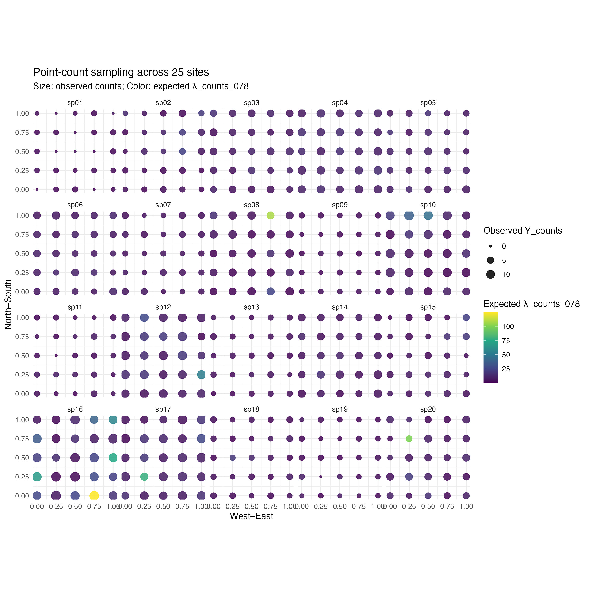
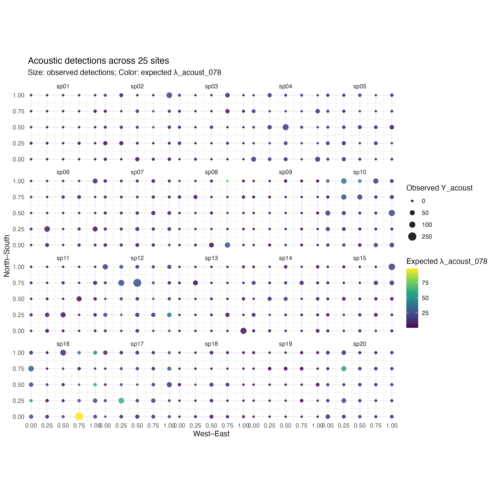

---
editor_options:
  chunk_output_type: console
---

# Multi-species and site (location) level effect

## Packages
```{r}
library(tidyverse)
```

## Simulated data

Let's assume that we have sites (point counts of 50m fixed radius) $m = 1,2,~...~,~M=25$ and species $s = 1,2,~...~,S = 20$ in the same area of 100 ha (following the approach in \href{https://besjournals.onlinelibrary.wiley.com/doi/10.1111/2041-210X.12856}{Lopez et al. 2017}). Our latent state $X_{m,s}$ is the site-level log-abundance state for species $s$ at site $m$, which follows a stationary Ornstein-Uhlenbeck, OU, diffusion for Gompertz on log-scale:

$$
X_{t+1, s} = a_s + c_s * X_{t, s} + \epsilon_{t}; ~ \epsilon \sim \text{Normal}(0,\sigma_s^2)
$$

where $a_s$ control the drift (the initial condition at $t=1$, and then equivalent to the maximum growth rate in a population model), $c_s$ controls the mean-reverting dynamic (such as the strength of density dependence, $c = 1 + b$ in a population model), and $\epsilon_{t}$ captures stochasticity in the process, distributed as a normal random variable with some noise of the process $\sigma_s^2$. Under stationarity and independence across sites, we can estimate the mean of the log-counts as a function of the control drift and mean-reverting dynamic:

$$
\text{E}[X_{\infty, s}] = \mu_s= \frac{a_s}{1-c_s}
$$
and variance:

$$
\text{Var}[X_{\infty, s}] = \frac{\sigma_s^2}{1-c_s^2}
$$

For the simulations, we will sample $X_{m,s}$ i.i.d. (independent and identical distributed) across $m$ from this stationary distribution.

The expected counts per site:

$$
\text{E}[\lambda_{m,s}^{Counts}] = \text{E}[\exp(X_{m,s})] = \exp(\mu_s + 0.5 \times \sigma_{X,s}^2)
$$

For point counts of 0.78 ha, 50m fixed radius. The observed point-count counts are $Y_{m,s}^{Counts} \sim \text{Binomial}(\text{size} = \text{round}(\lambda_{m,s}^{Counts}), \text{p} = \tau_s)$, where $\tau_s$ ranges between 0 and 1, and is a species-specific detection probability. 

The expected counts from the acoustic detections data is

$$
\text{E}[\lambda_{m,s}^{Acoust}] = \text{E}[\exp(\alpha_ + \gamma_s  X_{m,s})] = \exp(\alpha_ + \gamma_s \mu_s + 0.5 \gamma^2_s \sigma_{X,s}^2)
$$

This expected count could use a fixed ratio $\zeta_s$

$$
\text{E}[\lambda_{m,s}^{Acoust}] = \zeta_s \times \text{E}[\lambda_{m,s}^{Counts}]
$$
then, $\alpha_s = \log(\zeta_s) + \mu_s (1-\gamma_s) + 0.5\sigma_{X,s}^2(1-\gamma_s^2)$.

The acoustic detection data are $Y_{m,s}^{Acous} \sim \text{Negative~Binomial}(r_s, p_{m,s})$, where $p_{m,s} = \frac{r_s}{r_s+\lambda_{m,s}^{(0.78)}}$ represents the success parameter, being a ratio of the overdispersion parameter $r_s$ and the sum of the overdispersion parameter and the mean expected counts $C_{m,s}^{Acoustic~Detections} = \lambda_{m,s}^{(0.78)} = e^{X_{m,s}}$.

These expected counts at the point (site) level (0.78 ha, 50m radius) then are extrapolated to the entire area of 100 ha as: $\Lambda_s^{(100)} = \frac{100 \times \lambda_{m,s}^{(0.78)}}{0.78}$  (again, following the approach in \href{https://besjournals.onlinelibrary.wiley.com/doi/10.1111/2041-210X.12856}{Lopez et al. 2017}). 

Define the dimensions and indexing
```{r}
set.seed(42)
M <- 25
S <- 20
sites <- paste0("m", seq_len(M))
species <- paste0("sp", str_pad(seq_len(S), width = 2, pad = "0"))
```

Parameters:

```{r}
c_s     <- runif(S, min = 0.2, max = 0.9)
mu_s    <- runif(S, min = log(2), max = log(10))
a_s     <- mu_s * (1 - c_s)
sigma_s <- runif(S, min = 0.2, max = 0.8)

tau_s   <- runif(S, min = 0.5, max = 0.9)

# Acoustic proportionality parameters (ζ_s)
gamma_s <- runif(S, min = 0.5, max = 1.0)
#r_s     <- runif(S, min = 2, max = 15)      # NB overdispersion
```

Draw stationary $X_{m,s}$, for each species
```{r}
E_X  <- a_s / (1 - c_s)
VarX <- sigma_s^2 / (1 - c_s^2)
SD_X <- sqrt(VarX)

X_df <- map_df(seq_len(S), function(s) {
  tibble(
    species = species[s],
    site    = sites,
    X       = rnorm(M, mean = E_X[s], sd = SD_X[s])
  )
})
```

Target acoustic counts
```{r}
zeta_s <- runif(S, min = 0.8, max = 1.5)

# Solve alpha_s to hit the target mean ratio zeta_s exactly
alpha_s <- log(zeta_s) + E_X * (1 - gamma_s) + 0.5 * VarX * (1 - gamma_s^2)
```


Expected counts per site
```{r}
lambda_df <- X_df |>
  left_join(tibble(species = species, 
                   tau = tau_s, 
                   gamma = gamma_s, 
                   alpha = alpha_s), 
            by = "species") |>
  mutate(
    # Counts expected
    lambda_counts_078 = pmax(exp(X), 1e-6),
    # Acoustic expected: proportional to counts mean
    log_lambda_acoust_078 = alpha + gamma * X,
    lambda_acoust_078 = pmax(exp(log_lambda_acoust_078), 1e-6)
  )

plot(lambda_df$lambda_counts_078, lambda_df$lambda_acoust_078)
abline(a = 0, b = 1, col = "blue")
```

Calibrate $r_s$
```{r}
lambda_mean_s <- exp(E_X + 0.5 * VarX)
vmr_target_s <- runif(S, min = 5, max = 50)
lambda_acoust_mean_s <- zeta_s * lambda_mean_s
r_s <- lambda_acoust_mean_s / (vmr_target_s - 1)
```

Observations
```{r}
obs_df <- lambda_df |>
  left_join(tibble(species = species, r = r_s, 
                   lambda_mean_s = round(lambda_mean_s)), # fix the n at the expected lambda
            by = "species") |>
  mutate(
    # Counts: Binomial detection
    Y_counts = rbinom(n(), size = lambda_mean_s, prob = tau),
    # Acoustics: Negative Binomial
    p_nb     = r / (r + lambda_acoust_078),
    Y_acoust = rnbinom(n(), size = r, prob = p_nb)
  )

obs_df %>%
  group_by(species) %>%
  summarise(meanCounts = mean(Y_counts),
            varCounts = var(Y_counts), 
            VMR_counts = varCounts/meanCounts, #most are between 0 and 1, but some >1!
            meanAcouDet = mean(Y_acoust),
            varAcouDet = var(Y_acoust), 
            VMR_AcouDet = varAcouDet/meanAcouDet)  # correctly overdispersed!
```

Spatial grid of this point counts
```{r}
# Spatial coordinates for the 25 points (5x5 grid)
grid_dim <- 5
coords <- expand.grid(ix = seq_len(grid_dim), iy = seq_len(grid_dim)) %>%
  mutate(
    x = (ix - 1) / (grid_dim - 1),   # West–East
    y = (iy - 1) / (grid_dim - 1),   # North–South
    site = paste0("m", (iy - 1) * grid_dim + ix)
  ) %>%
  select(site, x, y)

spatial_df <- obs_df %>%
  left_join(coords, by = "site") 

# Plot counts
ggplot(spatial_df, aes(x = x, y = y)) +
  geom_point(aes(size = Y_counts, color = lambda_counts_078), alpha = 0.85) +
  scale_size_continuous(name = "Observed Y_counts", 
                        range = c(1, 5), 
                        breaks = c(0, 5, 10, 15)) +
  scale_color_viridis_c(name = "Expected λ_counts_078") +
  facet_wrap(~ species, ncol = 5) +
  labs(title = "Point-count sampling across 25 sites",
       subtitle = "Size: observed counts; Color: expected λ_counts_078",
       x = "West–East", y = "North–South") +
  coord_fixed() + 
  theme_minimal(base_size = 11)
ggsave(filename = "figs/sim_counts.jpg", width = 10, height = 10, units = "in", dpi = 300)


# Plot acoustics
ggplot(spatial_df, aes(x = x, y = y)) +
  geom_point(aes(size = Y_acoust, color = lambda_acoust_078), alpha = 0.85) +
  scale_size_continuous(name = "Observed Y_acoust", 
                        range = c(1,5), 
                        breaks = c(0, 50, 100, 250)) +
  scale_color_viridis_c(name = "Expected λ_acoust_078") +
  facet_wrap(~ species, ncol = 5) +
  labs(title = "Acoustic detections across 25 sites",
       subtitle = "Size: observed detections; Color: expected λ_acoust_078",
       x = "West–East", y = "North–South") +
  coord_fixed() + theme_minimal(base_size = 11)
ggsave(filename = "figs/sim_acoustic.jpg", width = 10, height = 10, units = "in", dpi = 300)

```




